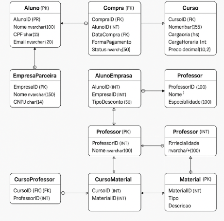

# 🎓 Projeto de Banco de Dados

Este projeto apresenta o modelo de banco de dados normalizado em **quarta forma normal (4FN)**, focado na estrutura de um e-commerce de cursos de MBA e pós-graduação. Foi desenvolvido com SQL Server e contém scripts organizados, procedures, views, triggers e jobs para geração de relatórios automáticos.

---

## 📁 Estrutura do Projeto

- `Scripts.sql`: contém a criação de tabelas, constraints, views, procedures e triggers.
- `Job.sql`: job do SQL Server Agent para execução automática dos relatórios.
- `Diagrama.png`: representação gráfica da estrutura relacional do banco.

---

## 🧠 Objetivo

Criar uma base de dados robusta, relacional e normalizada, que permita:

- Organização eficiente de dados de alunos, cursos e compras.
- Geração de relatórios estratégicos.
- Manutenção de integridade referencial e integridade multivalorada (4FN).
- Escalabilidade e automação com SQL Server Agent.

---

## 🗃️ Modelagem Relacional

A estrutura contempla:

- **Aluno**: informações pessoais dos alunos.
- **Curso**: dados de cursos disponíveis.
- **Compra**: pedidos feitos por alunos.
- **CursoCompra**: mapeamento de cursos em cada compra (resolvendo N:N).
- **Categoria**: categorias/classificações dos cursos.
- **Instituicao**: instituição de ensino responsável pelo curso.

---

## 📌 Normalização

- **1FN**: Atomicidade dos dados em todas as tabelas.
- **2FN**: Separação de dependências parciais em tabelas específicas (ex: Categoria).
- **3FN**: Eliminação de dependências transitivas (ex: dados institucionais separados).
- **4FN**: Evita dependências multivaloradas — uso de tabela associativa `CursoCompra`.

---

## 🧩 Diagrama Entidade-Relacionamento

> Veja o arquivo `Diagrama.png`

---

## 📜 Conteúdo dos Scripts (`Scripts.sql`)

- Criação de tabelas com `PRIMARY KEY` e `FOREIGN KEY`
- Criação de `VIEWS` para relatórios como:
  - Compras com dados do curso e aluno
  - Total de compras por aluno
  - Faturamento por instituição
- Criação de `STORED PROCEDURES` com lógica encapsulada para geração dos relatórios
- Criação de `TRIGGERS` para:
  - Atualização de timestamp em alterações
  - Prevenção de remoções inconsistentes

---

## ⚙️ Job Agendado (`Job.sql`)

- Job: `JobRelatoriosMBA`
- Execução: Diariamente às 08:00
- Ações:
  - Executa as stored procedures de relatório automaticamente
  - Pode ser expandido para enviar e-mails ou armazenar histórico

---

## 🧪 Tecnologias Utilizadas

- **SQL Server**
- **SQL Server Agent**
- **T-SQL**
- **Diagrama gerado com AI/Visio/Draw.io (para apresentação)**

---

## 📈 Possíveis Extensões

- Integração com Power BI para visualização dos dados
- Exportação automática de relatórios (CSV, PDF ou e-mail)
- Integração com uma API para cadastro de alunos e compras

---

## 🧑‍💻 Autor

**Yan Furlan**  
Programador especializado em bancos de dados (Oracle, SQL Server, MySQL, Neo4j)  
📍 São Paulo, Brasil  
📧 yangabrielfurlan@gmail.com  
📞 +55 12 99600-9247  
🔗 [LinkedIn](https://www.linkedin.com/in/yan-furlan-455ab820b/)

---

## 🏁 Como Executar

1. Execute o script `Scripts.sql` no SSMS para criar toda a estrutura.
2. Execute `Job.sql` no banco `msdb` para registrar o job.
3. Veja os resultados no agendamento automático ou chamando os relatórios via `EXEC nome_procedure`.

---
